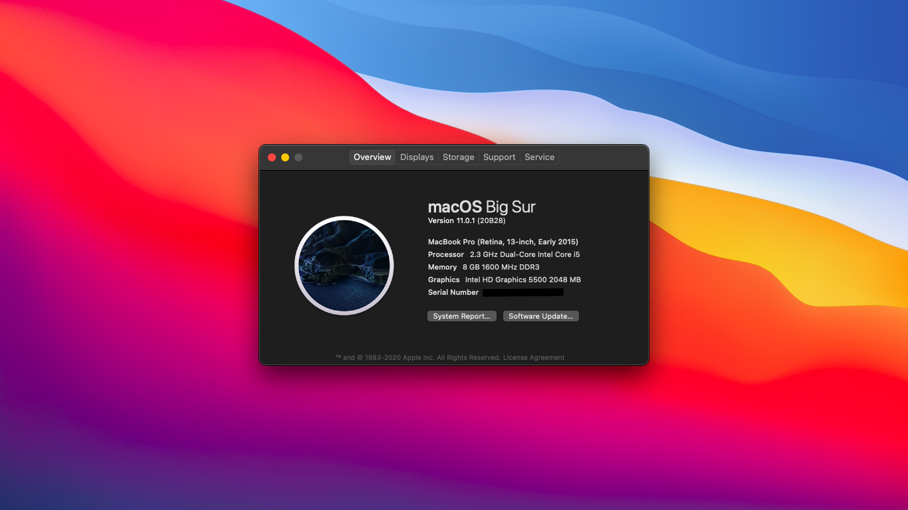

# ThinkPad T450 Big Sur OpenCore


## Introducción

- Configuración completa del ThinkPad T450 macOS Big Sur 11.0.1
- OpenCore 6.0.3
- Instalación con método vanilla [Olarila](https://www.olarila.com/).
- Sustituir el EFI del usb de Olarila por el EFI del repositorio al momento de la instalción.
- Para el wifi instalar HeliPort (wifi-bluetooth-intel) o desde [OpenIntelWireless](https://github.com/OpenIntelWireless).
- Tarjeta de sonido por defecto Layout-id = 32, ruido de los auriculares use el script de reparación de la tarjeta de sonido (ALCPlugFix).
- Funciona en Catalina 10.15.7

## Hardware

```  
- Machine Type Model: 20BUS0X10K.

- CPU：Intel Core i5 (5th Gen) 5300U / 2.3 GHz.

- Graphics：Intel HD 5500 Graphics.

- Audio Codec: Realtek ALC3232.

- Wireless Intel Dual Band Wireless-AC 7265.

```

## BIOS (1.37)
-  Security -> Security Chip: **Disabled**;
-  Memory Protection -> Execution Prevention: **Enabled**;
-  Virtualization -> Intel Virtualization Technology: **Enabled**;
-  Internal Device Access -> Bottom Cover Tamper Detection: must be **Disabled**;
-  Anti-Theft -> Current Setting: **Disabled**;
-  Anti-Theft -> Computrace -> Current Setting: **Disabled**;
-  Secure Boot -> Secure Boot: **Disabled**;
-  UEFI/Legacy Boot: **UEFI Only**;
-  CSM Support: **Yes**.

## Funciona
- Sleep/Wake up
- Wifi
- Bluetooth
- iMessage, FaceTime, App Store, iTunes Store
- Ethernet card
- sound card
- USB
- The battery
- touch pad
- little red dot
- SD card reader

## No Funciona
- VGA

## Gracias
 Por la configuración para la T450s [CLAY-BIOS](https://github.com/CLAY-BIOS/Lenovo-ThinkPad-T450s-Big-Sur-OpenCore).